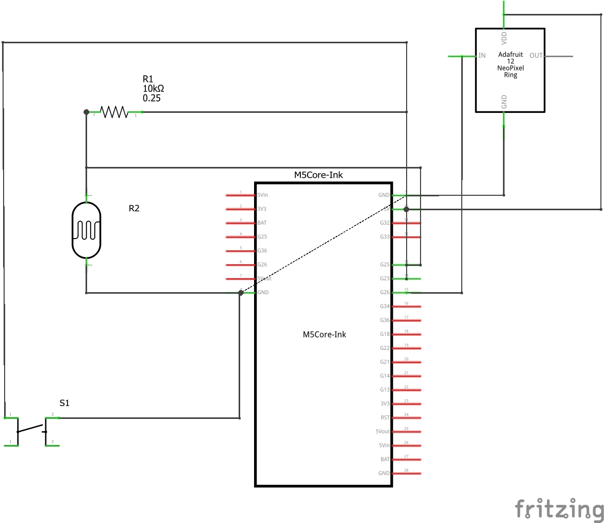
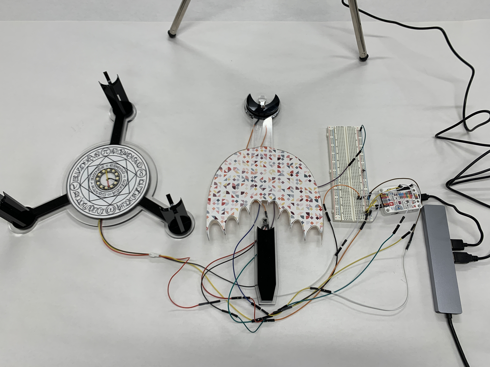
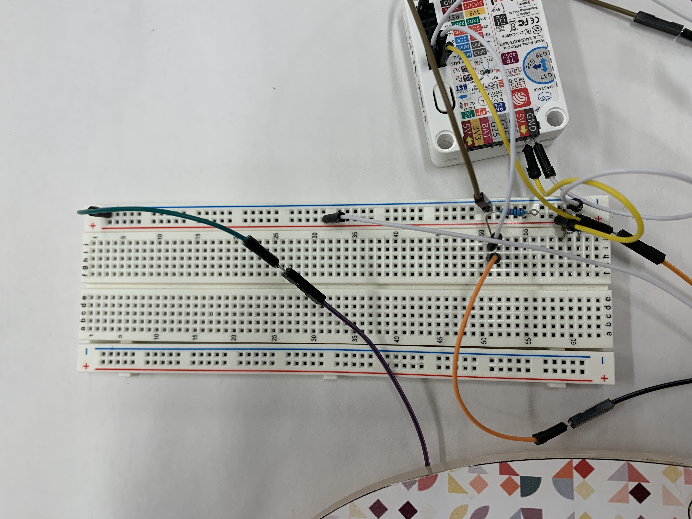
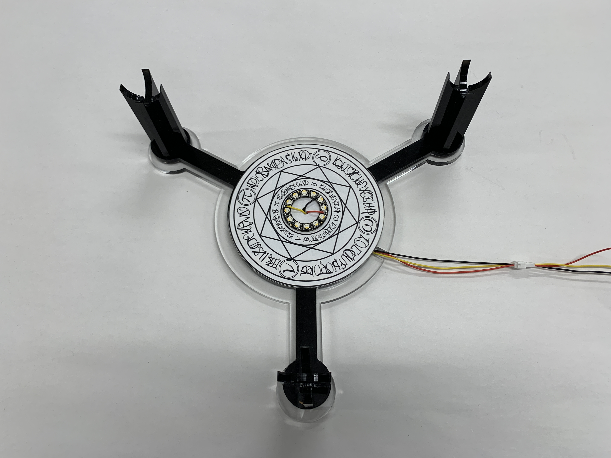
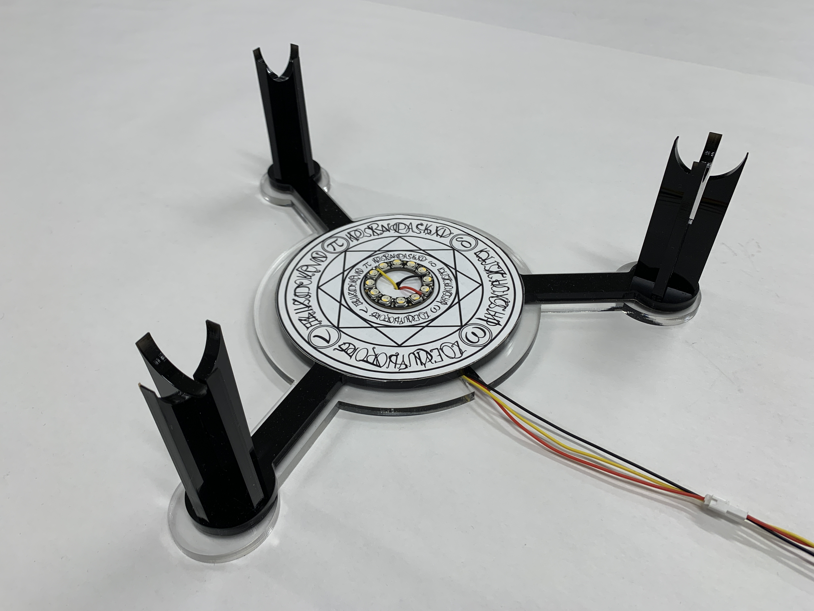
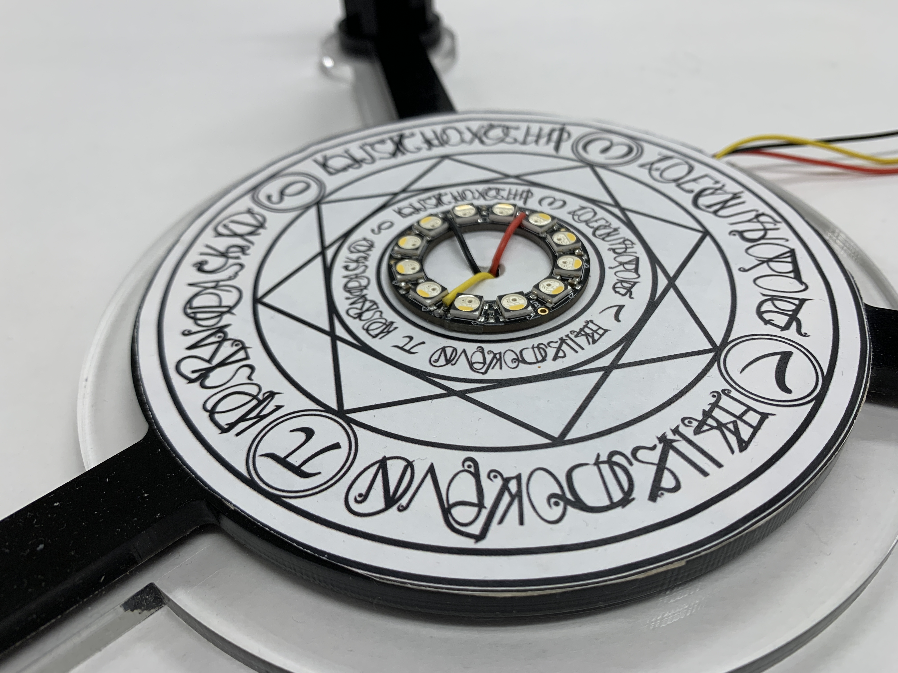
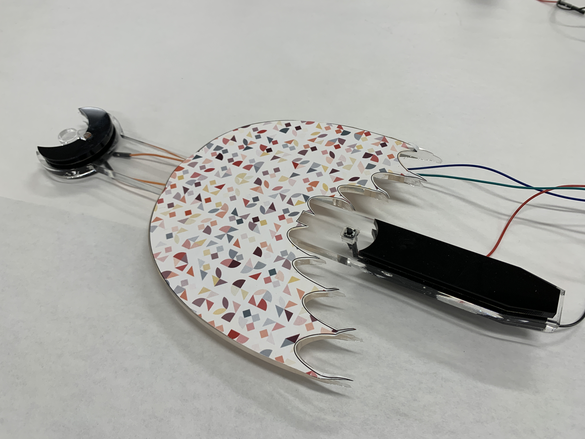
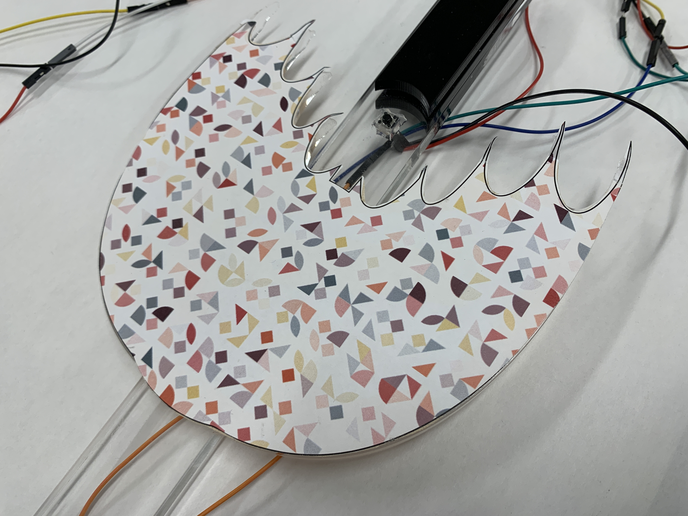
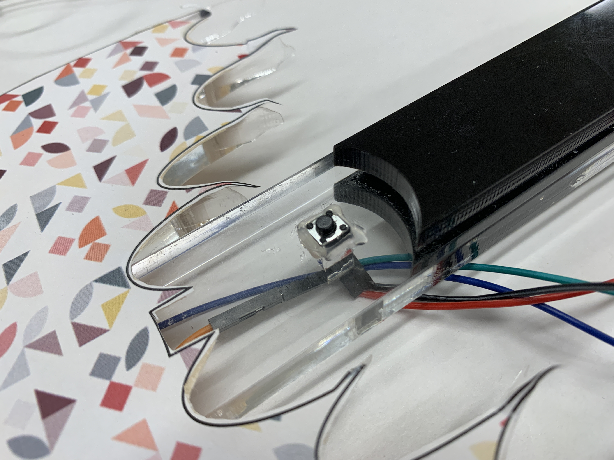
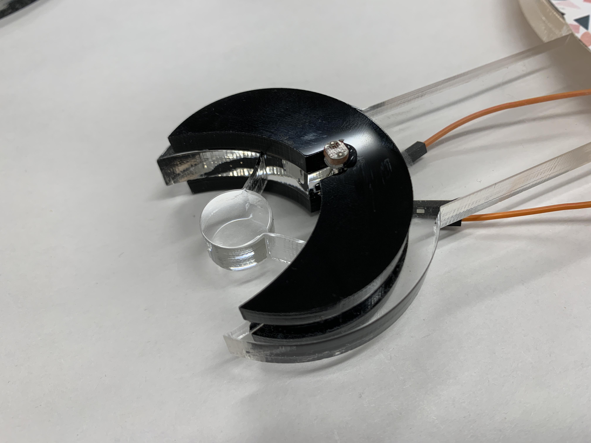

#Introduction
## In this project, I set out to explore the potential of using Arduino and Unity Vuforia AR to create interactive AR experiences. My goals were to learn how to integrate Arduino sensors and actuators with Unity Vuforia, and to create a simple AR game using these tools.

#Implementation
- Unity Editor and Arduino are the main two tools I used in this project. To build the communication between physical and virtual, I used Vuforia Engine within the Unity Editor to make the AR part happen. And then simply use the serial port to make communication between them. 

- To be more specific, when Arduino is talking to unity, I am printing bytes to the serial monitor based on sensor inputs. And when unity is talking back to Arduino, I will have the unity runtime write bytes back to Arduino and use "readByteUntil" to get the bytes from the virtual parts.

#Hardware
##Parts
- Photoresistor
- M5 CoreInk
- A button
- Adafruit NeoPixel Ring

##Schema


##Wirings




#Firmware
```
#include <Adafruit_NeoPixel.h>
#ifdef __AVR__
#include <avr/power.h>  // Required for 16 MHz Adafruit Trinket
#endif
// Which pin on the Arduino is connected to the NeoPixels?
#define neoPin 25  // On Trinket or Gemma, suggest changing this to 1

// How many NeoPixels are attached to the Arduino?
#define NUMPIXELS 12  // Popular NeoPixel ring siz

// When setting up the NeoPixel library, we tell it how many pixels,
// and which pin to use to send signals. Note that for older NeoPixel
// strips you might need to change the third parameter -- see the
// strandtest example for more information on possible values.
Adafruit_NeoPixel pixels(NUMPIXELS, neoPin, NEO_GRBW + NEO_KHZ800);

//constants
const int bufferSize = 20;
const int photoPin = 26;
const int lightThreshold = 100;
const int darkThreshold = 500;
const int buttonPin = 23;

//variables
char myCol[bufferSize];
int lineFeed = 10;
int ledPin = 10;
int printByte1 = 10;
int printByte2 = 20;
int printByte3 = 30;
int printByte4 = 40;
int printByte5 = 50;
int photoValue = 0;
int currentButtonValue;
int lastButtonValue;
bool ledState;

//timers
unsigned long intakeTimer = 0;
unsigned long outputTimer = 0;

void setup() {
  // put your setup code here, to run once:
  Serial.begin(9600);
  pinMode(ledPin, OUTPUT);
  pinMode(buttonPin,INPUT_PULLUP);
  intakeTimer = millis();
  outputTimer = millis();
  pixels.begin();
  pixels.clear();
  pixels.show();
  pixels.setBrightness(50);
  digitalWrite(ledPin, HIGH);
  currentButtonValue = digitalRead(buttonPin);
}

void loop() {

  photoValue = analogRead(photoPin);// Intake the photocell data

  // intake data from unity and act accordingliy
  if (millis() > intakeTimer + 8) {
    Serial.readBytesUntil(lineFeed, myCol, 1);
    if (strcmp(myCol, "F") == 0) {
      //Fire
      for (int i = 0; i < 13; i++) {
        pixels.setPixelColor(i, pixels.Color(255, 0, 0));
        pixels.show();
      }
    } else if (strcmp(myCol, "I") == 0) {
      
      // Ice
      for (int i = 0; i < 13; i++) {
        pixels.setPixelColor(i, pixels.Color(0, 0, 255));
        pixels.show();
      }
    } else if (strcmp(myCol, "G") == 0) {
      
      // green
      for (int i = 0; i < 13; i++) {
        pixels.setPixelColor(i, pixels.Color(0, 255, 0));
        pixels.show();
      }
    }
    intakeTimer = millis();
  }

  // output data to unity based on sensor
  if (millis() > outputTimer + 8) {
    photoValue = analogRead(photoPin);
    lastButtonValue = currentButtonValue;      // save the last state
    currentButtonValue = digitalRead(buttonPin); // read new state
    // Serial.println("");
    // Serial.println(lastButtonValue);
    // Serial.println(currentButtonValue);

    if (lastButtonValue == HIGH && currentButtonValue == LOW) {
      Serial.println(printByte3);
    }
    // Serial.println(photoValue);
    if (photoValue <= lightThreshold) {
      Serial.println(printByte1);
    } else {
      Serial.println(printByte2);
    }

    outputTimer = millis();
  }
}
```

#Software
Apart from the firmware, the Unity editor is also a big part of the project. But it will be a little hard to include the entire Unity project here. I will just use several screenshots to demonstrate here.


#Enclosure
The concept setup in this project is about "the summoning ritual". So I used laser cuts to make those enclosures. For example, I have the magic circles mapped with the crystal pillar in the virtual part. And the magic wand used by the user.

##The Magic Circle




##The Wand





#Conclusion
Overall, my project has provided me with valuable insights into the potential and challenges of using Arduino and Unity Vuforia for creating interactive AR experiences. I hope that my work will inspire others to explore the possibilities of these tools and to continue pushing the boundaries of AR technology.